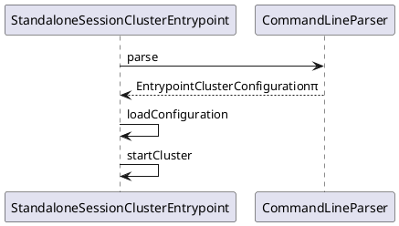

在启动Standalone模式的Flink JobManager的时候，运行的是org.apache.flink.runtime.entrypoint.StandaloneSessionClusterEntrypoint，在其main方法中，其主要分为3个步骤：
```
1. 使用CommandLineParser解析main方法传入的args，并校验合法性
2. 调用父类ClusterEntrypoint的loadConfiguration方法，将CommandLineParser解析出来的EntrypointClusterConfiguration对象中的配置和config/flink-conf.yaml的配置项内容合并，返回Configuration对象；
3. 根据Configuration的内容，构造StandaloneSessionClusterEntrypoint实例，并调用其startCluster方法，完成启动。
```
其调用关系时序图可以参考图下所示：

### startCluster的过程详解

