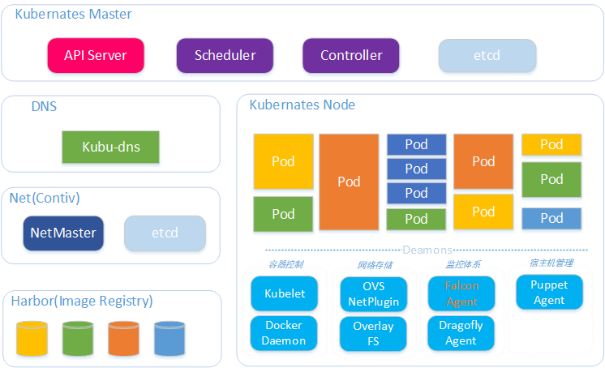

### Flink On Kubernates
#### K8S整体架构
在唯品会内部有一些不同的计算框架，有实时计算的，有机器学习的，还有离线计算的，所以需要一个统一的底层框架来进行管理，因此将Flink迁移到了K8S上。 
在K8S上使用了思科的contiv网络组件，每个docker容器都有独立的ip，对外也是可见的。实时平台的融合器整体架构如下图所示。

#### 基于StatefulSet模式部署Flink
对于Flink来说，使用sts的最大的原因是pod的hostname是有序的；这样潜在的好处有
* hostname为-0和-1的pod可以直接指定为jobmanager；可以使用一个statefulset启动一个cluster，而deployment必须2个；Jobmanager和TaskManager分别独立的deployment
* pod由于各种原因fail后，由于StatefulSet重新拉起的pod的hostname不变，集群recover的速度理论上可以比deployment更快（deployment每次主机名随机）

#### 容器的entrypoint
由于要由主机名来判断是启动jobmanager还是taskmanager，因此需要在entrypoint中去匹配设置的jobmanager的主机名是否有一致。
传入参数为："cluster ha"；则自动根据主机名判断启动那个角色；也可以直接指定角色名称
docker-entrypoint.sh的脚本内容如下：

~~~bash
#!/bin/sh
 
# If unspecified, the hostname of the container is taken as the JobManager address
 
ACTION_CMD="$1"
 
# if use cluster model, pod ${JOB_CLUSTER_NAME}-0,${JOB_CLUSTER_NAME}-1 as jobmanager
if [ ${ACTION_CMD} == "cluster" ]; then
  jobmanagers=(${JOB_MANGER_HOSTS//,/ })
  ACTION_CMD="taskmanager"
  for i in ${!jobmanagers[@]}
  do
      if [ "$(hostname -s)" == "${jobmanagers[i]}" ]; then
          ACTION_CMD="jobmanager"
          echo "pod hostname match jobmanager config host, change action to jobmanager."
      fi
  done
fi
 
# if ha model, replace ha configuration
if [ "$2" == "ha" ]; then
  sed -i -e "s|high-availability.cluster-id: cluster-id|high-availability.cluster-id: ${FLINK_CLUSTER_IDENT}|g" "$FLINK_CONF_DIR/flink-conf.yaml"
  sed -i -e "s|high-availability.zookeeper.quorum: localhost:2181|high-availability.zookeeper.quorum: ${FLINK_ZK_QUORUM}|g" "$FLINK_CONF_DIR/flink-conf.yaml"
  sed -i -e "s|state.backend.fs.checkpointdir: checkpointdir|state.backend.fs.checkpointdir: hdfs:///user/flink/flink-checkpoints/${FLINK_CLUSTER_IDENT}|g" "$FLINK_CONF_DIR/flink-conf.yaml"
  sed -i -e "s|high-availability.storageDir: hdfs:///flink/ha/|high-availability.storageDir: hdfs:///user/flink/ha/${FLINK_CLUSTER_IDENT}|g" "$FLINK_CONF_DIR/flink-conf.yaml"
fi
 
if [ ${ACTION_CMD} == "help" ]; then
    echo "Usage: $(basename "$0") (cluster ha|jobmanager|taskmanager|local|help)"
    exit 0
elif [ ${ACTION_CMD} == "jobmanager" ]; then
    JOB_MANAGER_RPC_ADDRESS=${JOB_MANAGER_RPC_ADDRESS:-$(hostname -f)}
    echo "Starting Job Manager"
    sed -i -e "s/jobmanager.rpc.address: localhost/jobmanager.rpc.address: ${JOB_MANAGER_RPC_ADDRESS}/g" "$FLINK_CONF_DIR/flink-conf.yaml"
    sed -i -e "s/jobmanager.heap.mb: 1024/jobmanager.heap.mb: ${JOB_MANAGER_HEAP_MB}/g" "$FLINK_CONF_DIR/flink-conf.yaml"
 
    echo "config file: " && grep '^[^\n#]' "$FLINK_CONF_DIR/flink-conf.yaml"
    exec "$FLINK_HOME/bin/jobmanager.sh" start-foreground cluster
 
elif [ ${ACTION_CMD} == "taskmanager" ]; then
    TASK_MANAGER_NUMBER_OF_TASK_SLOTS=${TASK_MANAGER_NUMBER_OF_TASK_SLOTS:-$(grep -c ^processor /proc/cpuinfo)}
    echo "Starting Task Manager"
 
    sed -i -e "s/taskmanager.heap.mb: 1024/taskmanager.heap.mb: ${TASK_MANAGER_HEAP_MB}/g" "$FLINK_CONF_DIR/flink-conf.yaml"
    sed -i -e "s/taskmanager.numberOfTaskSlots: 1/taskmanager.numberOfTaskSlots: $TASK_MANAGER_NUMBER_OF_TASK_SLOTS/g" "$FLINK_CONF_DIR/flink-conf.yaml"
 
    echo "config file: " && grep '^[^\n#]' "$FLINK_CONF_DIR/flink-conf.yaml"
    exec "$FLINK_HOME/bin/taskmanager.sh" start-foreground
elif [ ${ACTION_CMD} == "local" ]; then
    echo "Starting local cluster"
    exec "$FLINK_HOME/bin/jobmanager.sh" start-foreground local
fi
 
exec "$@"
~~~

#### 使用ConfigMap分发hdfs和flink配置文件
ConfigMap介绍参考：

https://kubernetes.io/docs/tasks/configure-pod-container/configure-pod-configmap/#create-configmaps-from-files

Q：为什么使用ConfigMap

A：由于hadoop配置文件在不同的环境不一样，不方便打包到镜像里面；因此合适的方式就只有2种，使用ConfigMap和Pod的InitContainer。使用InitContainer的话，可以wget获取远程的一个配置文件，但是这样还需要依赖一个配置服务。相比而已，ConfigMap更简单。

创建ConfigMap
~~~bash
kubectl create configmap hdfs-conf --from-file=hdfs-site.xml --from-file=core-site.xml
kubectl create configmap flink-conf --from-file=flink-conf/log4j-console.properties --from-file=flink-conf/flink-conf.yaml
~~~
使用describe命令查看创建的名词为hdfs-conf的ConfigMap，会显示文件的内容到控制台
~~~bash
kubectl describe configmap hdfs-conf
Name:         hdfs-conf
Namespace:    default
Labels:       <none>
Annotations:  <none>
Data
====
core-site.xml:
~~~
通过volumeMounts使用ConfigMap
Pod的Container要使用配置文件，则可以通过volumeMounts方式挂载到Container中。如下demo所示，将配置文件挂载到/home/vipshop/conf/hadoop目录下
~~~yaml
apiVersion: apps/v1
kind: StatefulSet
metadata:
  name: flink-jm
spec:
  selector:
    matchLabels:
      app: flink-jm
  serviceName: flink-jm
  replicas: 2
  podManagementPolicy: Parallel
  template:
    metadata:
      labels:
        app: flink-jm
    spec:
      terminationGracePeriodSeconds: 2
      containers:
      - name: test
        imagePullPolicy: Always
        image: 10.199.199.34:5000/flink:latest
        args: ["sleep", "1d"]
        volumeMounts:
        - name: hdfs-conf
          mountPath: /home/vipshop/conf/hadoop
      volumes:
      - name: hdfs-conf
        configMap:
        # Provide the name of the ConfigMap containing the files you want to add to the container
          name: hdfs-conf
~~~
创建好Pod后，查看配置文件的挂载
~~~bash
[hadoop@flink-jm-0 hadoop]$ ll /home/vipshop/conf/hadoop
total 0
lrwxrwxrwx. 1 root root 20 Apr  9 06:54 core-site.xml -> ..data/core-site.xml
lrwxrwxrwx. 1 root root 20 Apr  9 06:54 hdfs-site.xml -> ..data/hdfs-site.xml
~~~
配置文件是链接到了..data目录。
StatefulSet的配置
Flink的配置文件和hadoop的配置文件，依赖ConfigMap来分发

环境变量设置说明：
|环境变量名称|参数|内容|备注|
|------------ | -------------| -------------| -------------|
|JOB_MANGER_HOSTS|StatefulSet.name-0,StatefulSet.name-1|flink-cluster-0,flink-cluster-1|JM的主机名，短主机名；可以不用FQDN|
|FLINK_CLUSTER_IDENT|namespace/StatefulSet.name|default/flink-cluster|用来做zk ha设置和hdfs checkpiont的根目录|
|TASK_MANAGER_NUMBER_OF_TASK_SLOTS|containers.resources.cpu.limits|2|TM的slot数量，根据resources.cpu.limits来设置|
|FLINK_ZK_QUORUM|env:FLINK_ZK_QUORUM|***.***.***.***:2181|HA ZK的地址|
|JOB_MANAGER_HEAP_MB|env:JOB_MANAGER_HEAP_MB|value:containers.resources.memory.limit -1024|JobManager的Heap大小，由于存在Netty的堆外内存，需要小于container.resources.memory.limits；否则容易OOM kill。Container的内存上限比JobManager的-Xmx大1024MB|
|TASK_MANAGER_HEAP_MB|env:TASK_MANAGER_HEAP_MB|value: containers.resources.memory.limit -1024|TaskManager的Heap大小，由于存在Netty的堆外内存，需要小于container.resources.memory.limits；否则容易OOM kill。Container的内存上限比TaskManager的-Xmx大1024MB|

Pod的imagePullPolicy策略，测试环境Always，每次都pull，方便验证；线上则是IfNotPresent；线上如果对images做了变更，必须更改images的tag

完整的内容可以参考如下：

headless的service的yaml内容
~~~yaml
# headless service for statefulset
apiVersion: v1
kind: Service
metadata:
  name: flink-cluster
  labels:
    app: flink-cluster
spec:
  clusterIP: None
  ports:
    - port: 8080
      name: ui
  selector:
    app: flink-cluster
~~~
StatefulSet的yaml配置，启动2个TaskManager，每个TaskManager一个slot。
~~~yaml
# create flink statefulset
apiVersion: apps/v1
kind: StatefulSet
metadata:
  name: flink-cluster
spec:
  selector:
    matchLabels:
      app: flink-cluster
  serviceName: flink-cluster
  replicas: 4
  podManagementPolicy: Parallel
  template:
    metadata:
      labels:
        app: flink-cluster
    spec:
      terminationGracePeriodSeconds: 2
      containers:
      - name: flink-cluster
        imagePullPolicy: Always
        image: 10.199.199.34:5000/flink:1.4.2
        args: ["cluster", "ha"]
        volumeMounts:
          - name: hdfs-conf
            mountPath: /home/vipshop/conf/hadoop
          - name: flink-conf
            mountPath: /home/vipshop/conf/flink
          - name: flink-log
            mountPath: /home/vipshop/logs
        resources:
          requests:
            memory: "4096Mi"
            cpu: 1
          limits:
            memory: "4096Mi"
            cpu: 2
        env:
        - name: JOB_MANGER_HOSTS
          value: "flink-cluster-0,flink-cluster-1"
        - name: FLINK_CLUSTER_IDENT
          value: "default/flink-cluster"
        - name: TASK_MANAGER_NUMBER_OF_TASK_SLOTS
          value: "1"
        - name: FLINK_ZK_QUORUM
          value: "10.198.199.112:2181"
        - name: JOB_MANAGER_HEAP_MB
          value: "3072"
        - name: TASK_MANAGER_HEAP_MB
          value: "3072"
        ports:
        - containerPort: 6124
          name: blob
        - containerPort: 6125
          name: query
        - containerPort: 8080
          name: flink-ui
      volumes:
        - name: hdfs-conf
          configMap:
          # Provide the name of the ConfigMap containing the files you want to add to the container
            name: hdfs-conf
        - name: flink-conf
          configMap:
            name: flink-conf
        - name: flink-log
          hostPath:
            # directory location on host
            path: /tmp
            # this field is optional
            type: Directory
~~~

#### 服务部署状态
执行完前面操作后，可以查看到当前的StatefulSet状态
~~~bash
kubectl get sts flink-cluster -o wide
NAME            DESIRED   CURRENT   AGE       CONTAINERS      IMAGES
flink-cluster   4         4         1h        flink-cluster   10.199.199.34:5000/flink:1.4.2
~~~
容器的Pod状态
~~~bash
kubectl get pod -l app=flink-cluster  -o wide
NAME              READY     STATUS    RESTARTS   AGE       IP            NODE
flink-cluster-0   1/1       Running   0          1h        10.254.58.2   10.199.199.40
flink-cluster-1   1/1       Running   0          1h        10.254.60.2   10.199.199.38
flink-cluster-2   1/1       Running   0          1h        10.254.46.4   10.199.199.39
flink-cluster-3   1/1       Running   0          1h        10.254.60.3   10.199.199.38
~~~
相关的Service信息
~~~bash
kubectl get svc -l app=flink-cluster  -o wide
NAME            TYPE        CLUSTER-IP       EXTERNAL-IP   PORT(S)          AGE       SELECTOR
flink-cluster   ClusterIP   None             <none>        8080/TCP         2h        app=flink-cluster
~~~
这个时候就可以根据JobManager的UI来访问这个集群的节点等基本信息。