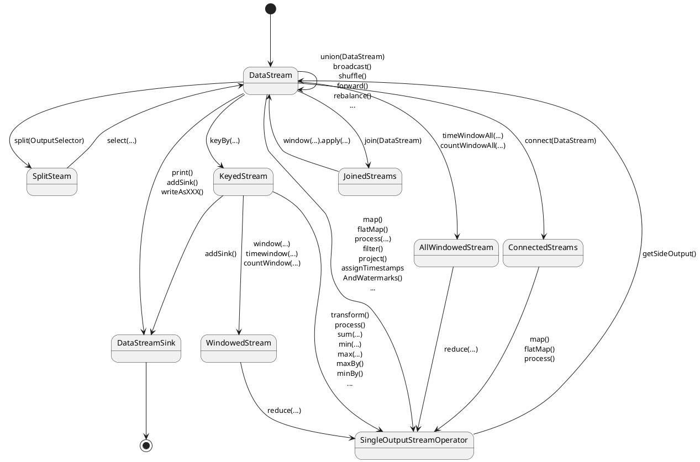
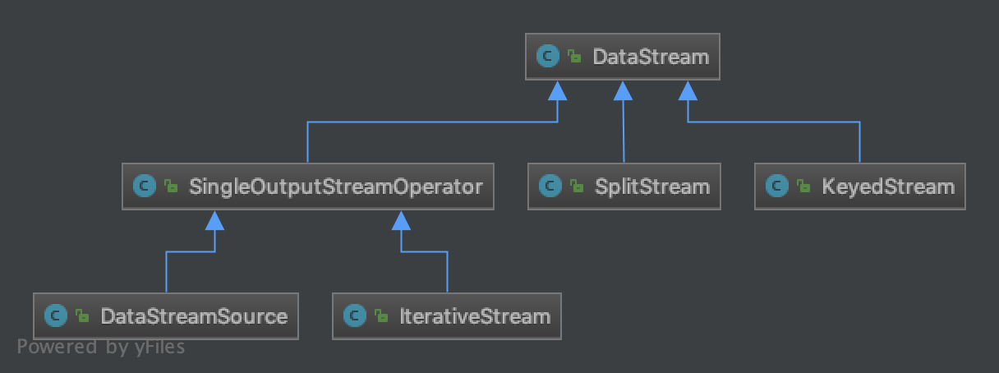
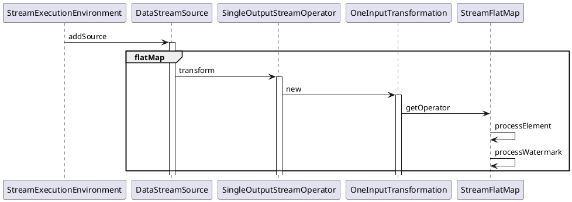

### Flink DataStream的主要转换关系
Flink为流和批操作分别提供了DataStream API和DataSet API，方便了业务代码的开发。其中DataStream的API可以通过Operator进行各种Stream的转换和操作。下图展示了DataStream的主要Operator之间的转换关系图。

### DataStream的类结构
DataStream是Flink流的核心基础API，表示了有相同数据类型的持续不断的一系列元素的组合。一种类型DataStream可以通过不同的操作转变为另外一种类型的DataStream，如map、flatMap等操作等。DataStream的主要类结构如下所示：

一个 DataStream可以从StreamExecutionEnvironment里面的若干方法获得
~~~java
StreamExecutionEnvironment env = StreamExecutionEnvironment.getExecutionEnvironment();
DataStream<T> input = env.addSource(SourceFunction);
/**其他方法包括：
* input = env.fromElements(T);
* input = env.createInput(InputFormat);
*/

~~~
DataStream上的转换操作都是逐条的，比如 map()、flatMap()、filter()等，以flatMap方法为例，说明一下DataStream内部是如何对输入的元素进行操作和处理的。

#### SingleOutputStreamOperator核心方法解析